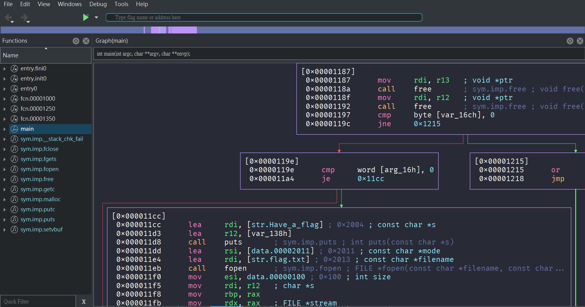

# Dracula for [Cutter](https://cutter.re/)

> A dark theme for [Cutter](https://cutter.re/).

## Install

1. Star and clone this repository.
2. Open Cutter and go to `Edit > Preferences > Appearance > Color Theme > Import (looks like the download button)`.
3. Click the import button and select the `Dracula` from `Theme` in this repository.
4. Go `Edit > Preferences > Appearance > Interface Theme` and select `Dark`.
5. Voila! Welcome to the world of vampires.

## Team

This theme is maintained by the following person(s) and a bunch of [awesome contributors](https://github.com/dracula/x64dbg/graphs/contributors).

|       |
| ------------------------------------------------------------------------------------------ |
| [CX330's GitHub](https://github.com/CX330Blake) [CX330's Blog](https://blog.cx330.tw) |

## Community

-   [Twitter](https://twitter.com/draculatheme) - Best for getting updates about themes and new stuff.
-   [GitHub](https://github.com/dracula/dracula-theme/discussions) - Best for asking questions and discussing issues.
-   [Discord](https://draculatheme.com/discord-invite) - Best for hanging out with the community.

## Dracula PRO

## License

[MIT License](./LICENSE)
